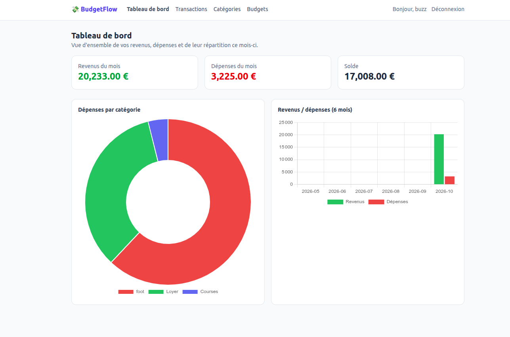
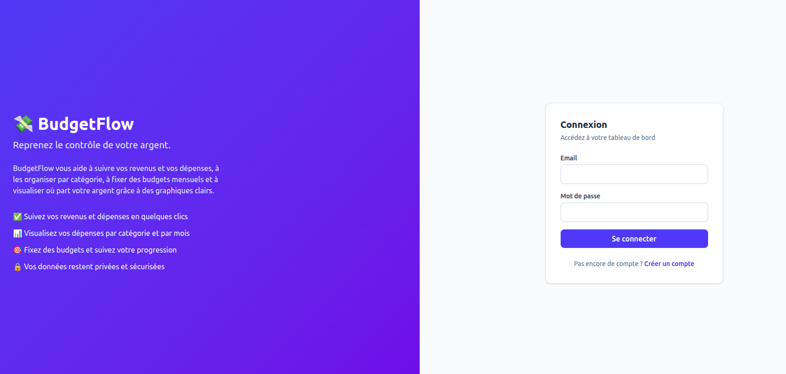
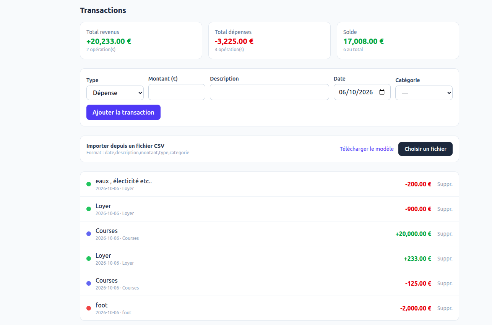
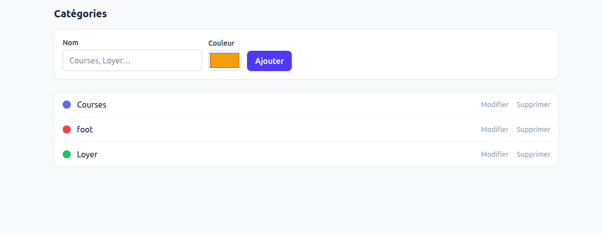
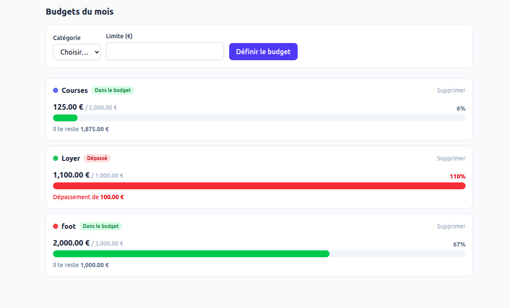

# 💸 BudgetFlow

> Une application web **full-stack** pour gérer son **budget personnel** : suivre ses dépenses, fixer des budgets et visualiser où part son argent — le tout lançable en **une seule commande** avec Docker.

<p>
  
  
  
  
  
  
  
</p>

---

## 📖 Présentation

**BudgetFlow** aide chaque utilisateur à garder le contrôle de ses finances. Après
inscription, on enregistre ses **revenus** et **dépenses**, on les classe par
**catégorie**, on fixe des **budgets mensuels**, et on suit la répartition de son
argent via un **tableau de bord graphique**.

Le projet est pensé comme une petite application réelle : authentification sécurisée
par **JWT**, **API REST**, base de données **PostgreSQL**, interface moderne et
responsive, et déploiement local **en une commande** grâce à Docker.

## ✨ Fonctionnalités

- 🔐 **Inscription / connexion** sécurisées (JWT)
- 💵 **Transactions** : ajout, modification, suppression de revenus et dépenses
- 🏷️ **Catégories** personnalisables (nom + couleur), éditables en ligne
- 🎯 **Budgets mensuels** par catégorie avec barre de progression et alertes
- 📊 **Tableau de bord** : solde, répartition des dépenses (camembert), évolution sur 6 mois

## 🖼️ Aperçu

### Tableau de bord


| Connexion | Transactions |
|:---:|:---:|
|  |  |

| Catégories | Budgets |
|:---:|:---:|
|  |  |

## 🚀 Lancer l'application en local

L'application complète (base de données + back-end + front-end) se lance avec **une
seule commande** grâce à Docker.

### Prérequis
- [Docker](https://www.docker.com/) **et** Docker Compose (inclus dans Docker Desktop)
- Git (pour cloner le projet)

### Démarrage

```bash
# 1. Récupérer le projet
git clone https://github.com/Buzz30Gotcho/budgetflow.git
cd budgetflow

# 2. Créer le fichier de configuration (.env) à partir du modèle
cp .env.example .env

# 3. Construire et démarrer toute la stack
docker compose up --build
```

➡️ Ouvrir ensuite **http://localhost:4200** dans le navigateur, puis créer un compte.

> 💾 Les données sont conservées dans un volume Docker (elles survivent au redémarrage).

### Arrêter l'application

```bash
docker compose down        # arrête l'application
docker compose down -v     # arrête et supprime aussi les données
```

<details>
<summary>⚙️ Lancer sans Docker (pour le développement)</summary>

**Prérequis** : Java 17+, Node.js 22+, Docker (pour la base).

```bash
# 1. Base de données
docker run -d --name budgetflow-db \
  -e POSTGRES_DB=budgetflow -e POSTGRES_USER=budgetflow -e POSTGRES_PASSWORD=budgetflow \
  -p 5433:5432 postgres:16

# 2. Back-end (http://localhost:8080)
cd backend
DB_URL=jdbc:postgresql://localhost:5433/budgetflow \
DB_USERNAME=budgetflow DB_PASSWORD=budgetflow \
./mvnw spring-boot:run

# 3. Front-end (http://localhost:4200)
cd frontend
npm install
npx ng serve
```
</details>

## 🏗️ Architecture

L'application est découpée en **3 parties indépendantes** :

```
┌──────────────┐    API REST / JSON (JWT)   ┌──────────────┐      JPA       ┌──────────────┐
│   Angular    │  ───────────────────────▶  │ Spring Boot  │  ──────────▶   │  PostgreSQL  │
│  (frontend)  │  ◀───────────────────────  │  (back-end)  │  ◀──────────   │ (base de     │
│  navigateur  │                            │   API REST   │                │   données)   │
└──────────────┘                            └──────────────┘                └──────────────┘
```

- **Frontend (Angular)** — l'interface affichée dans le navigateur.
- **Backend (Spring Boot)** — l'**API REST** : logique métier, sécurité, accès aux données.
- **Base de données (PostgreSQL)** — le stockage des utilisateurs, transactions, budgets…

Les deux côtés communiquent uniquement via l'**API REST** (messages JSON), sécurisée par
un **token JWT**. En mode Docker, un serveur **Nginx** sert le frontend et redirige les
appels `/api` vers le backend.

## 🛠️ Technologies & langages

**Langages utilisés**


| Couche | Langage | Frameworks / outils |
|--------|---------|---------------------|
| **Back-end** | Java 17 | Spring Boot 4 (Web, Security, Data JPA), Hibernate, JWT |
| **Front-end** | TypeScript | Angular 22, Tailwind CSS, Chart.js |
| **Base de données** | SQL | PostgreSQL 16 |
| **Infrastructure** | — | Docker, Docker Compose, Nginx, Maven |

## 📡 API REST

| Méthode | Endpoint | Description |
|---------|----------|-------------|
| `POST` | `/api/auth/register` | Inscription |
| `POST` | `/api/auth/login` | Connexion (renvoie un token JWT) |
| `GET` / `POST` / `PUT` / `DELETE` | `/api/categories` | Gestion des catégories |
| `GET` / `POST` / `PUT` / `DELETE` | `/api/transactions` | Gestion des transactions |
| `GET` | `/api/dashboard` | Données agrégées du tableau de bord |
| `GET` / `POST` / `PUT` / `DELETE` | `/api/budgets` | Gestion des budgets mensuels |

> Toutes les routes (sauf `/api/auth/**`) nécessitent le header `Authorization: Bearer <token>`.

## 📂 Structure du projet

```
budgetflow/
├── backend/               # API REST — Java / Spring Boot
│   ├── src/main/java/com/budgetflow/
│   │   ├── auth/            # inscription / connexion
│   │   ├── security/        # JWT, filtre, configuration de sécurité
│   │   ├── user/ category/ transaction/ budget/ dashboard/
│   │   └── common/          # gestion des erreurs
│   └── Dockerfile
├── frontend/             # Interface — Angular / TypeScript
│   ├── src/app/
│   │   ├── core/           # modèles, services API, interceptor & guard JWT
│   │   ├── features/       # auth, dashboard, transactions, categories, budgets
│   │   └── layout/         # navigation
│   ├── nginx.conf
│   └── Dockerfile
└── docker-compose.yml    # orchestration des 3 services
```

## 👤 Auteur

**Frédéric Makha SAR** — Développeur Full-Stack

[](https://www.linkedin.com/in/frederic-sar-a377061a3)
[](https://github.com/Buzz30Gotcho)
